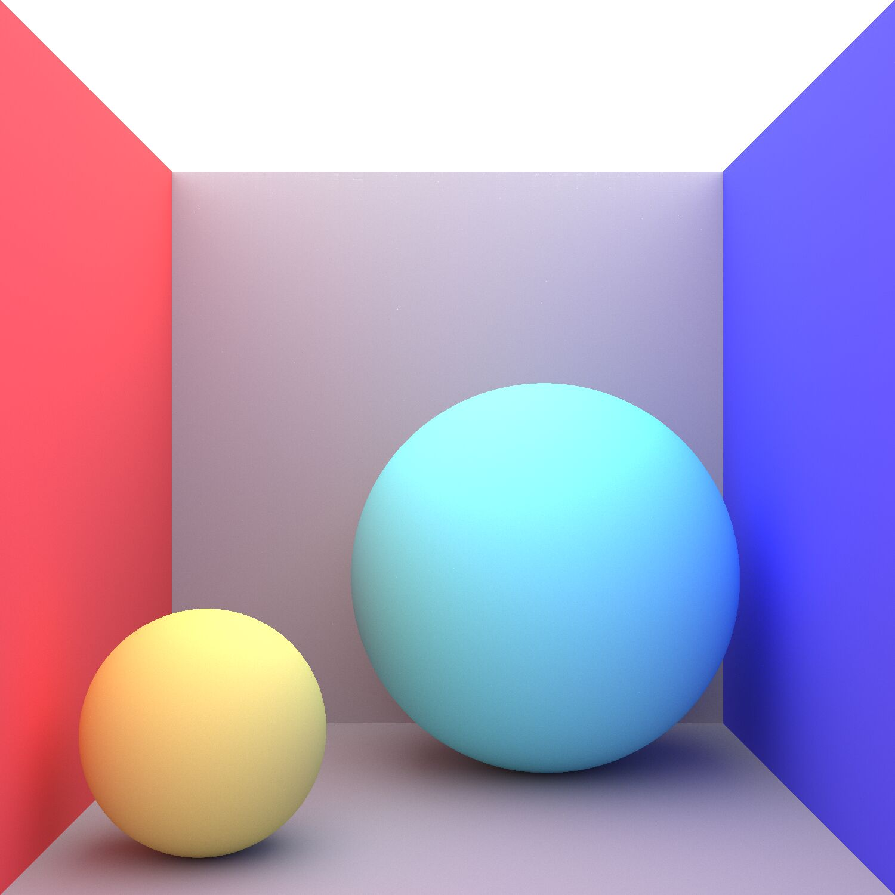

# CPU based RayTracer

This is a cpu based RayTracer for rendering scenes.

The RayTracer is written as part of my Studies at FHNW as part of the lectures "Computer Graphics" and "Workshop Spatical Computing"

## Feature List

* Monte-Carlo based Ray-Tracing
* Gaussian Anti Aliasing
* Multi-Threaded
* Textures (with Emission)
* Transparency (Refraction and Reflection)
* Rendering of Primitive shapes:
  * Spheres
* Boolean operators on geometry:
  * And
  * Or (WIP)
  * Not (WIP)
* Multi Platform (Runs on Linux, Windows and Mac)
* Live View of the rendering progress

Saves the finished rendering in the current working dir as a .png image

## Example Renderings

